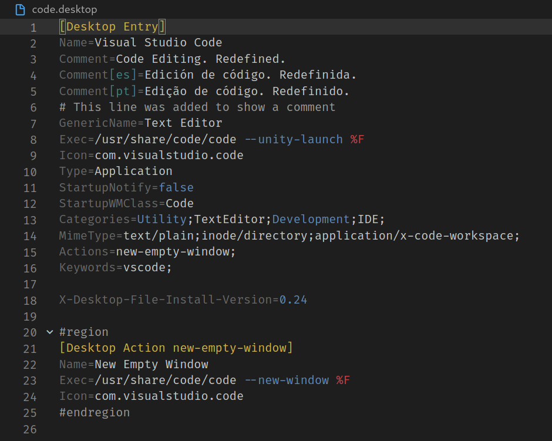
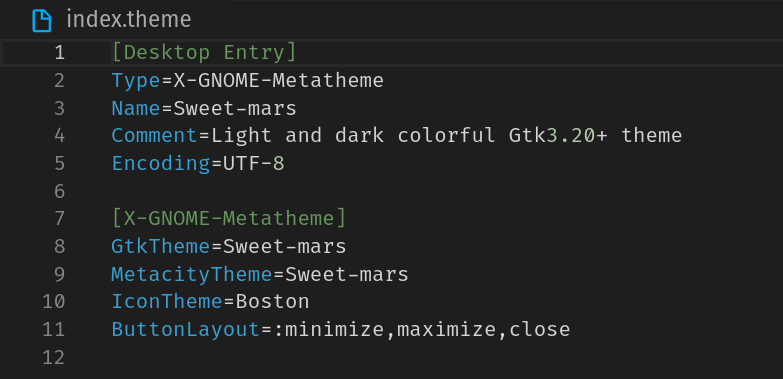

<h1 align="center">
    <br>
        
    <br>
    Desktop File Support
</h1>

<p align="center">
    <a href="https://github.com/nico-castell/desktop-file-support/releases"></a>
    <a href="https://github.com/nico-castell/desktop-file-support/commits"></a>
    <a href="LICENSE"></a>
    <a href="https://github.com/nico-castell/desktop-file-support"></a>
    <a href="https://www.paypal.com/donate?hosted_button_id=C38RSCD9QGZBQ"></a>
    <br><b>Live long, and prosper.<br>- Spock</b>
</p>

## Desktop Entry files
This extension allows VS Code to highlight the syntax of a desktop entry file (`.desktop`), much like in gedit.

For the full documentation of *.desktop* files, visit the freedesktop [specification](https://specifications.freedesktop.org/desktop-entry-spec/latest/index.html).

<!--  -->


## Theme Index Files
Additionally, this extension highlights `[X-GNOME-Metetheme]` and it's keys.

<!--  -->

<!-- This GNOME theme can be found at: https://www.gnome-look.org/p/1253385/ -->

##  Features
1. Syntax Highlighting for .desktop files.
2. Extra syntax highlighting for [Theme Index files](https://people.gnome.org/~shaunm/admin-guide/themes-17.html).
3. Snippet for .desktop files: A standard way to tell gnome to open a new window.
    ```
    Exec=/usr/share/code/code newwin # expands to:
    Exec=/usr/share/code/code --no-sandbox --new-window %F
    ```
4. Folding regions through the use of `#region` and `#endregion`. This is not officially part of *.desktop* files, but it should help you.

##  Known Issues
1. The scoping of the syntax highlighting could be improved.
